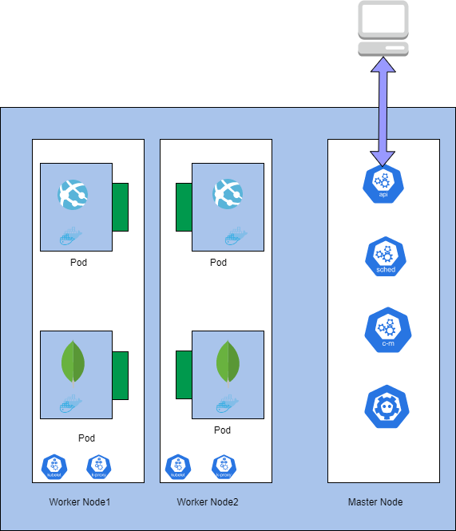
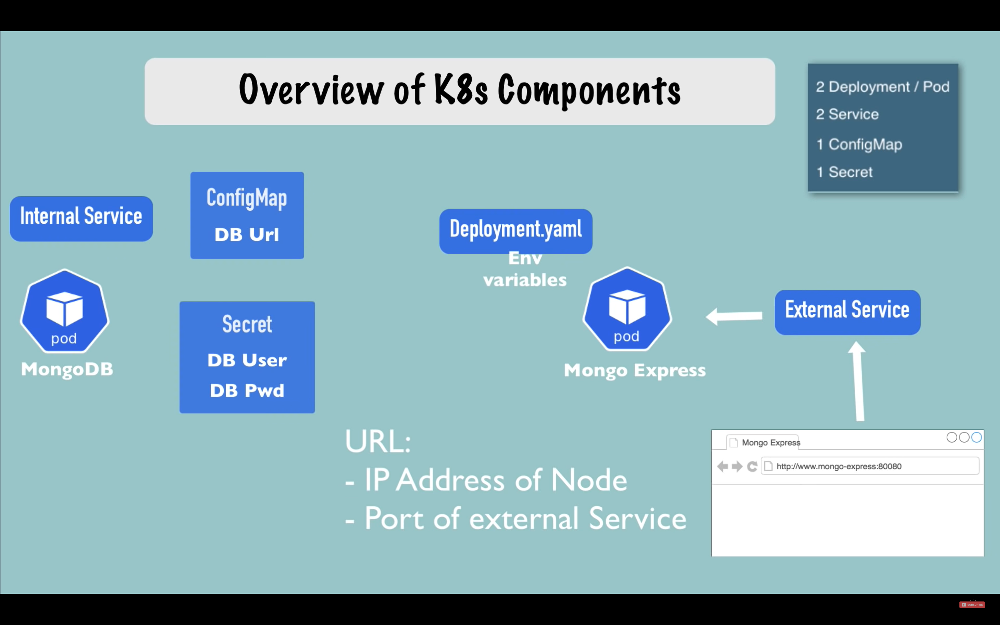

# Basic components of Kubernetes



# Simple example



# Steps to follow :- 

## 1. Create Secrets

```
kubectl apply -f mongoSecret.yml
```

## 2. Create deployment for mongo (internal service)

```
kubectl apply -f mongoDBInternal.yml
```

## 3. Create config map

```
kubectl apply -f configMap.yml
```

## 4. Create deployment for mongo-express (external service)

```
kubectl apply -f mongoExpress.yml
```

## 5. Port forwording 

```
 kubectl port-forward <pod-name> <localport>:<serviceport>
```

## 6. Open localhost:<localport>